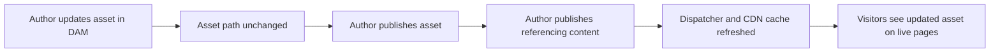
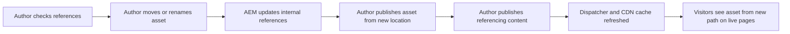

# DAM Training & Usage Guide for Admins

**Ticket:** AAEMDAM-3736 — Enablement | DAM Training & Usage Guide for Admins

---

## Objective

Facilitate SSHRS understanding of how to properly use the DAM to effectively manage assets, maintain governance, and support property teams without risking misuse or disorganization, by:

- Reviewing the **current state** DAM structural architecture, aligning on **optimal state** as well as an optimal state implementation and adoption strategy
  - Outlining an **adoption roadmap** (metadata/tag cleanup, folder refactoring, Dynamic Media readiness)

- Clarifying **admin/author processes** (uploading, versioning, approvals, avoiding broken references)
- How **tags (`shrss` namespace)** and **metadata (`shrssmetadataschema`)** should be used together
- Capturing **follow-up work** for a new backlog/roadmap

---

## Review and discuss

- DAM content architecture
- Assets metadata
- Operations (admin/authoring processes such as versioning, scheduling, workflows, etc.)
- Dynamic Media

---

## 1. DAM Content Architecture

### Current state: How the DAM is structured

- How and where to store assets in the correct hierarchy

### Optimal state: Discuss optimal structure, adoption strategy/roadmap

1. Possible approach for handling legacy/migrated assets while: also adopting new structure, optimizing for Dynamic Media
   1. Create `migrated-assets` folder:
      1. A-Z subfolders
         1. Move assets by name
      2. 0-9 subfolders
         1. Move assets by number
      3. Create nested folders as needed for < 1000 max per folder requirement (A-01, A-02).
         1. MAYBE nested subfolders based on asset type here
   
   2. Export Excel report of all assets in `<parent folder> -> photography`
      - In report spreadsheet, map assets to new home under `migrated-assets`
   
   3. Use ["Renovator"](https://adobe-consulting-services.github.io/acs-aem-commons/features/mcp-tools/renovator/index.html) tool or equivalent to move migrated assets in bulk to `migrated-assets`. Tool will locate and update all corrresponding asset references in pages, etc. https://adobe-consulting-services.github.io/acs-aem-commons/features/mcp-tools/renovator/index.html
   
      > [!CAUTION]
      >
      > Before executing on a large number of assets, or in production, execute on a small, targeted set of assets in a lower environment and perform regression testing.
      >
      > 1. Example: Subset of assets referenced in a specific set of test pages, experience fragments, and content fragments
   
   4. Define new, optimized folder structure
      1. Already done via `shrss-primary` structure?
   
   5. Require all new assets to be placed in new structure

- Considerations for Dynamic Media
  - Unique file names REQUIRED

- Best practices

> [!TIP]
>
> When defining DAM structure, adhere to the maxim that asset folder names are for structure and governance, not search. Search for assets by metadata and tags.

---

## 2. Assets Metadata

- Metadata schemas
- Folder metadata schemas
- Metadata profiles
- Best practices

------

## 3. DAM Operations & Governance

> [!NOTE]
>
> > How and where to store assets in the correct hierarchy - https://shrss.atlassian.net/browse/AAEMDAM-3736
>
> In this section, we're discussing how/where to upload in the DAM based on *current state*. In that sense, "correct hierarchy" is defined as "correct hierarchy for current architectural structure." 

### Creating (Uploading) assets

- Cafe imagery → `/cafe/<property>/en/photography`
- Hotel imagery → `/hotel/<property>/en/photography`
- Reverb imagery → `/reverb/<property>/en/photography`
- Corporate/careers imagery → `/corporate/careers/en/...`
- Training/demos → `/training/...` only

### Updating assets

*This section focuses on “update” actions: replacing files, refining metadata, and deciding when an update should be a new version vs. a brand-new asset.*

#### Updating an asset file (same asset, new version)

Use this when the **identity of the asset stays the same** (same photo/graphic, improved crop, color correction, minor copy fix, etc.) and you want to preserve references and history.

**Steps: Replace the binary and create a new version**

1. **Locate the asset**
   - In **Assets > Files**, navigate to the asset’s folder.
2. **Open the asset details**
   - Click the asset to open its detail page (or use the top toolbar if you prefer inline tools).
3. **Upload the updated file**
   - Use **`Replace`** (or `Upload new version` if surfaced in your UI) to upload the new binary with the **same filename**, or
   - Drag‑and‑drop the updated file **onto the existing asset** (depending on your configured UI/workflow).
4. **Confirm the version**
   - AEM automatically creates a **new version** of the asset.
   - Optionally, open the **Timeline** / **Versions** panel and:
     - Add a **label** and **comment** (e.g., `v2 – color corrected; approved by Brand`).
5. **Validate references**
   - Use **References** to confirm which pages/components use this asset.
   - Spot‑check at least one **published page** to ensure the updated file looks correct.

**When to use this path**

- You’re fixing **minor issues** (typos, color correction, safe‑area tweaks).
- You want **all existing references** (Sites pages, CFs, external consumers) to get the updated asset.
- You need a **version history** for audit purposes.

**When not to use this path**

- The change fundamentally alters the **meaning or usage** of the asset (e.g., new campaign, new offer, new legal terms).
  - In that case, create a **new asset** with a new filename and retire or unpublish the old asset.

#### Updating metadata (title, tags, rights, usage)

**Steps: Update metadata on an existing asset**

1. **Open the asset details** in Assets.
2. Click **`Edit`** or **`View Properties`**.
3. Update relevant metadata fields:
   - **Title / Description** – human‑readable; used in search and in authoring UI.
   - **Tags** – apply appropriate `shrss:*` tags (brand, location, usage type, rights, etc.).
   - **Rights / expiry / usage** – ensure rights information matches the current contract.
4. **Save & close**.
5. Optionally, **republish** the asset so downstream consumers see the updated metadata immediately (depending on your replication / CDN behavior).

**Best practices**

- Prefer **tags and structured fields** over free‑text for any data you may search/filter on later.
- If metadata updates are part of a **larger correction** (e.g., fixing a rights issue), consider:
  - Creating a **new version** first, then updating metadata, so there’s a clear audit trail.
- Avoid making **frequent tiny edits** (e.g., title changes several times a day) to reduce noisy version history.

### Versioning assets

- Use **asset versioning** when updating images currently used on live pages.

> [!TIP]
>
> See "Appendix - Asset Versioning & Cleanup" for a deep dive into asset versioning use cases, how-to's, and best practices.

### Deleting assets (safely)

Deleting is **destructive** and can break pages, content fragments, and external consumers. Treat deletion as a **last step** in an asset’s lifecycle.

#### Before you delete: checks for authors/admins

Before deleting any asset:

- **Check references**
  - Select the asset and open the **`References`** panel:
    - Confirm whether it’s used on **Sites pages**, **content fragments**, **experience fragments**, or **other assets**.
- **Unpublish first**
  - If the asset is published:
    1. Use **`Manage Publication`** or **`Unpublish`** from the toolbar.
    2. Confirm unpublish has completed (especially in prod).
  - This avoids 404s and broken content in the live experience while you clean up authoring references.
- **Update or remove references**
  - For each reference:
    - Replace with a **new asset**, *or*
    - Remove the asset from the component/CF entirely.
  - Only proceed to delete once you’re confident no live or upcoming content needs it.

#### Deleting an asset (step-by-step)

1. **Navigate to the asset** in **Assets > Files**.
2. Confirm you’ve:
   - **Checked references**, and
   - **Unpublished** the asset (if needed), and
   - **Updated/remediated** all references.
3. Select the asset and click **`Delete`**.
4. Confirm the deletion in the dialog.

#### Deletion best practices

- **Never delete a published, referenced asset** without:
  - First unpublishing it, and
  - Updating or removing all references.
- **Time deletions carefully**
  - Perform deletions **outside of peak traffic** when possible.
  - Coordinate with **business owners** if assets are part of campaigns or legal content.
- **Prefer “retirement” over immediate deletion**
  - For high‑risk assets (legal, brand, compliance):
    - Unpublish and clearly mark them as **Retired** via metadata or tags.
    - Only delete once the business confirms no future need.

#### Restoring deleted assets from backup

Understand AEMaaCS content backup/restore functionality: https://experienceleague.adobe.com/en/docs/experience-manager-cloud-service/content/operations/restore

- Understand how long deleted assets are retained and who can restore them.
- Use restores sparingly; restored assets may still need **republishing** and **reference validation**.

### Avoiding broken references (moving, renaming, deleting, updating)

*This section applies whenever you **move**, **rename**, **update**, or **delete** assets.*

Broken references typically show up as:

- Missing images on pages,
- Components showing “asset not found”,
- Or incorrect/old imagery lingering because the wrong asset was updated.

#### Core principle

> **Once an asset is in use, its path and identity are “contractual.” Treat changes as a controlled operation, not a casual tweak.**

#### How to avoid breaking references

- **Always use the References panel before changing an asset**
  - Before you **move**, **rename**, **delete**, or **bulk update**:
    - Open **`References`** to see where the asset is used.
    - If it appears on **critical pages** (home, navigation hubs, key campaigns), plan more carefully.
- **Avoid changing paths for in-use assets**
  - If you must move assets (e.g., folder cleanup):
    - Move them in **small batches**.
    - Immediately test key pages that reference them.
- **Be deliberate when replacing files**
  - If replacing the binary would **change the message, brand, or legal meaning**, create a **new asset** and update references instead of overwriting.
- **Do not delete referenced assets**
  - Only delete assets once:
    - All references have been updated or removed, and
    - The asset is **unpublished**, and
    - Stakeholders have confirmed it is safe to retire.
- **Use preview/stage (UAT) environments for risky changes**
  - For large cleanups (mass moves, tag overhauls, metadata refactors):
    - Trial the change in **stage/UAT**.
    - Validate that **no critical references break** before repeating in prod.

#### Suggested workflow for high‑risk changes

For assets used on **critical pages** (home, key campaigns, navigation):

1. **Identify references**
   - Use **References** to list all consuming pages/CFs.
2. **Plan the change**
   - Decide if it’s a **version update** (same asset, new version) or a **replacement asset** (new identity).
3. **Apply change in stage/UAT**
   - Perform the move/rename/update.
   - Run link checks and visual tests on key pages.
4. **Communicate**
   - Let relevant stakeholders (marketing, brand, product owners) know what is changing and when.
5. **Apply in prod with validation**
   - Repeat the change in prod during a safe window.
   - Immediately verify that **pages load correctly** and **assets render as expected**.

---

### Scheduling publication and unpublishing

Scheduling lets you plan **when** assets (and optionally their referencing content) go live or come down, instead of doing everything manually in real time. In AEM Assets, you typically schedule via **Manage Publication**.

**When to use scheduling**

- **Planned launches** – campaign start times, new site/section go‑lives, promotions.
- **Planned takedowns** – rights expiry, end of campaigns, legal or compliance deadlines.
- **Off‑hours operations** – avoid making changes during peak business hours but have them take effect at a specific time.

**How to schedule a publish**

1. In **Assets > Files**, select one or more assets.
2. Click **Manage Publication**.
3. Choose **Publish**.
4. Decide whether to:
   - Publish **now**, or  
   - **Schedule** for a specific date/time.
5. (Recommended) Enable the option to **include references** (pages, CFs, XFs) where appropriate so those consumers are published along with the asset.
6. Review the summary and **Confirm**.

**How to schedule an unpublish**

1. In **Assets > Files**, select the asset(s) you plan to retire.
2. Click **Manage Publication**.
3. Choose **Unpublish**.
4. Choose a **future date/time** (for scheduled takedown) or **now**.
5. Decide whether to include **referencing pages/CFs/XFs** if you also want those to unpublish or be updated.
6. Review and **Confirm**.

**Scheduling best practices (SHRSS)**

- **Coordinate with campaigns and business owners** – especially for Homepage, navigation, and major campaign assets.
- Use **scheduling for predictable events** (launches, takedowns, rights expiry), but still:
  - Verify content in **Stage/UAT** before the scheduled time.
  - Add a brief **calendar reminder** around the scheduled event to double‑check live behavior.
- Be mindful of **time zones** (for example, confirm whether the instance is using [INSERT_TIME_ZONE_REFERENCE] as the reference time).
- For critical assets, plan **staggered scheduling**:
  - Schedule assets first,
  - Then pages/CFs/XFs in the same window,
  - And monitor the live site right after the window.

---

### Workflows and approvals for asset changes (future capability)

Today, SHRSS does **not** have formal approval workflows configured for Sites or Assets. Authors and admins coordinate approvals **outside AEM** (for example, via email or chat), and then publish assets manually.

AEM, however, supports **workflows** that can be used to enforce approvals before assets are published. Even if not implemented yet, it’s useful for Admins and Authors to understand what a **basic approval workflow** could look like.

##### What workflows do (conceptually)

- Provide a **structured sequence of steps** (review, approve, reject) for changes.
- Assign **tasks** to specific roles or groups (for example, DAM Reviewer, Brand/Legal).
- Optionally **automate publish/unpublish** when approvals are complete.
- Record an **audit trail** (who approved what, when, with what comments).

Out of the box, AEM includes:
- Technical workflows like **DAM Update Asset** (handles renditions, metadata extraction).  
- General models like **Request for Activation** for content approvals.

For SHRSS, a future **“Asset Approval”** workflow could be based on these patterns and tailored to your groups.

##### Example: Lightweight SHRSS asset approval workflow (future blueprint)

_This is a proposed model; it does **not** exist yet in the current SHRSS implementation._

**Roles (example)**

- **Content Author** – uploads/updates assets, sets metadata and tags.
- **DAM Reviewer** – checks metadata quality, tagging, folder placement.
- **Brand/Legal Approver (optional)** – reviews high‑risk assets (brand, legal, rights sensitive).

**Proposed flow**

1. **Author prepares the asset**
   - Uploads the asset into the correct **folder**.
   - Sets mandatory **metadata and tags** (for example brand, usage, rights, expiry).
   - Reviews the asset in **Stage/UAT** if needed.

2. **Author starts the approval workflow**
   - From the asset, chooses **Start Workflow** (or similar) and selects:
     - `SHRSS – Asset Approval` (future custom model based on OOTB patterns).
   - Adds a brief **comment** (what changed, campaign, due date).

3. **DAM Reviewer step**
   - Workflow assigns a task to the **DAM Reviewer** group.
   - Reviewer checks:
     - **Metadata completeness and accuracy**.
     - **Tagging and folder placement** against SHRSS guidelines.
     - **Rights/usage fields** for compliance.
   - Reviewer chooses:
     - **Approve** – moves the workflow forward, _or_
     - **Reject** – sends the asset back to the author with comments.

4. **Brand/Legal step (optional)**
   - For specific folders or tag combinations (for example, brand‑critical or legal‑sensitive assets), the workflow adds a second approval step.
   - Brand/Legal Approver:
     - Confirms **visual and messaging alignment**.
     - Confirms **rights and restrictions**.
     - Approves or rejects with comments.

5. **Automatic publish on final approval**
   - When all required steps are approved:
     - Workflow can **auto‑publish** the asset to **Publish**.
     - Optionally, it can **notify the author** that the asset is live.
   - If desired, the workflow can also:
     - Trigger a reminder to **publish referencing pages/CFs/XFs**, or  
     - Automatically create a task for page authors.

6. **Audit and reporting**
   - Workflow history provides a **trace**:
     - Who approved,
     - When they approved,
     - What comments they added.
   - This is especially useful for **rights management and compliance**.

------

### Search & Findability

- **Current authoring search experience**
  - Authors likely search by **free text** (filename/title) and maybe by **tags**, or opt to **browse** to locate an asset.
  - Many assets might not be consistently tagged yet.
- **Optimal authoring search experience**
  - Author uses magnifying glass in header of AEM admin console and enters minimal criteria based on asset metadata/tags and immediately finds the relevant asset resource

- **Best practices**
  - Always apply:
    - At least **one tag** (`lob`?)
    - A **property** tag (when property-specific)
    - A **category** tag (logo, lifestyle, rooms, etc.)

------

### 3.3 Roles & Responsibilities

> In addition to **Librarian**, **Content Admins** and **Product Owner** will have access to the Adobe DAM, but Content Authors will not. - https://shrss.atlassian.net/browse/AAEMDAM-3736

**Roles**

- **DAM Architect/Librarian**
  - Owns folder conventions.
  - Owns `shrss` taxonomy and metadata schema roadmap.
  - Approves new top-level tags and schema changes.
- **Content Administrators (Brand/Property author leads?)**
  - Train their teams on “golden path” folder + tag usage.
  - Request changes to tags/metadata.
- **Developers / AEM TAs**
  - Ensure Sites templates and components correctly use tags and metadata.
  - Support automation where possible (e.g., default tags by folder).

**KT Activities/Questions**

- As an exercise, align current user/group/permission reality to `Permissions` sheet in `/SHRSS_Knowledge_Transfer/DAM/00_Drafts_and_Resources/SHRSS-Content-Architecture-Workbook-v1_3_Working_20260218.xlsx`
  - How do **Librarian**, **Content Admins**, **Product Owner**, and **Content Author** roles align to currently defined AEM groups and permissions?
    - Are changes required based on updated governance policies, business processes,etc?

---

## 4. Dynamic Media (DM)

> How Dynamic Media fits into publishing - https://shrss.atlassian.net/browse/AAEMDAM-3736

- **Current state (from original agenda)**

  - Dynamic Media is:
    - **Provisioned**, configured in lower environments.
    - **Not configured** in production.
    - Core components on Sites currently **do not use DM components**.

- **DM adoption/content strategy**
  - Which content types would benefit most from DM?
    - Hero images? Carousels? Media-heavy experiences?
  - What would need to change in DAM to adopt DM smoothly?
    - Clear separation of hero vs. raw imagery?
    - Consistent aspect-ratio tagging or naming?
  - **Implementation roadmap**
    - DAM integration and asset processing
    - Swap out relevant authoring components
  

---

## Appendix A - Asset Versioning & Cleanup

**Audience:** Authorized content authors, DAM architect, and admins  
**Purpose:** Explain _how_ to version assets in AEMaaCS, _when_ to version, what SHRSS’s **automatic version retention** looks like, and how to avoid both data loss and unnecessary bloat.

---

#### What a “version” is in AEM Assets

In AEM Assets, a **version** is a snapshot of an asset at a point in time:

- The **binary file** (image, video, PDF, etc.)
- Its **metadata** (title, description, tags, custom fields)
- Sometimes associated renditions and technical properties (as handled by DAM Update workflows)

Versions are accessed via the **Timeline** in the Assets UI, and can be:

- **Compared** (e.g., see when something changed)
- **Restored** (roll back to an earlier state)
- **Labelled** (e.g., “Approved 2026‑03”, “Pre-campaign update”)

For SHRSS, versions are meant to be a **short‑to‑medium‑term safety net**, not long‑term archival.

---

#### How authors create versions (step‑by‑step)

**A. Automatic versioning on replace/upload**

Whenever you **upload a new file over an existing asset** (same path + same asset), AEM automatically creates a new version.

1. Navigate to the asset in **Assets**.
2. Click **Upload** and select a file **with the same name** into the same folder, or drag & drop into the folder and choose to **replace** the existing asset.
3. AEM:
   - Re-runs the **DAM Update Asset** processing.
   - **Creates a new version** in the background.

> **Result:** You now have `Version N+1` with the new binary. Older versions (N, N‑1, …) are still visible in Timeline (subject to retention described in 4.x.4).

**B. Manual “Save as Version” (metadata or binary changes)**

Use this when you’re making a **significant change** (binary or critical metadata) and you want an explicit rollback point.

1. Open the asset’s details page.
2. Click **Timeline** on the left.
3. In the Timeline panel, use the **“Save as Version”** option.
4. Optionally:
   - Enter a **label** (e.g., “Legal-approved”, “Pre‑localization”).
   - Enter a **comment** (why you’re versioning).

> **Result:** A new version is created with current binary + metadata. You can restore this specific version later.

**C. Restoring a previous version**

When an asset update goes wrong:

1. Go to the asset and open **Timeline**.
2. Scroll to the desired older version (e.g., “Version 3”, or the one with your label).
3. Click **Revert** / **Restore** (wording may differ slightly depending on UI version).
4. Confirm.

> **Result:** AEM creates a new _current_ version whose content equals the previously selected version (i.e., rollback creates yet another version).

---

#### When to version vs. when it may not make sense

**Good times to create a new version (or rely on auto‑versioning):**

- You are **replacing the asset binary** (new design, updated photo, fixed typo in PDF).
- A change is **legally or compliance significant** (e.g., removing sensitive info, updating T&Cs).
- You’re introducing a **campaign-critical change** right before go‑live and want a quick rollback path.
- You’re making **major metadata changes** that change how an asset is discovered or used (e.g., changing campaign, brand, usage rights tags).

**Usually _not_ worth a manual version:**

- Small metadata tweaks (fixing a misspelled title, adding one non-critical keyword).
- Bulk tag cleanups that can be redone easily in bulk if needed.
- Temporary edits that you will immediately overwrite again before anything is published or used.

> **Rule of thumb for authors:**  
> - If it directly affects what end‑users see or what legal/compliance expects → **version**.  
> - If it’s minor internal housekeeping → **no manual version**, rely on the normal automatic versions on binary changes.

---

#### SHRSS version retention and audit log policy (stage + prod)

The **mt-stage-prod** maintenance configuration defines how long versions and audit logs last in SHRSS **Stage** and **Prod** environments:

```yaml
kind: "MaintenanceTasks"
version: "1"
metadata:
  envTypes: ["stage", "prod"]
data:
  versionPurge:
    maximumVersions: 10
    maximumAgeDays: 30
    paths: ["/content"]
    minimumVersions: 1
    retainLabelledVersions: false
  auditLogPurge:
    rules:
      - all:
          maximumAgeDays: 30
          contentPath: "/content"
          types: ["replication", "dam", "pages"]
```

**Practical implications for authors:**

- **Where this applies:**  
  - All content under `/content`, **including `/content/dam/...`**.
- **How many versions are kept:**
  - At least **1 version** per asset.
  - Up to **10 versions** per asset.
- **How long versions are kept:**
  - Versions older than **30 days** are eligible for purge.
  - Combined with the 10‑version cap, this means you can’t rely on very old or very frequent versions being available.
- **Labelled versions are _not_ exempt:**
  - `retainLabelledVersions: false` means labels are **for human clarity only**—they do **not** protect a version from purge.
- **Audit logs:**
  - Detailed DAM audit events (`dam`, `replication`, `pages`) older than **30 days** are purged.
  - You cannot rely on more than ~30 days of audit history for troubleshooting “who changed what when?”

> **Takeaway for authors:**  
> Essentially, you have a **working month** of history and up to ~10 recent versions per asset as your safety net—this is not long‑term archive.

---

#### Automated versioning: what is and isn’t recommended

**What AEM does by default (SHRSS included):**

- **Binary replacement creates a version automatically.**
  - Anytime you upload a new file for an existing asset (same path), AEM versions it.
- **Metadata-only edits do _not_ auto‑version** unless you explicitly do “Save as Version”.
- **There is no default “version on publish” workflow**:
  - Publishing/unpublishing does not, by itself, create versions.

**Custom “auto versioning” workflows (what we’re _not_ doing today):**

You _could_ build custom workflows, for example:

- Create a version every time an asset is published.
- Create a version every time specific metadata fields change.

However, given SHRSS’s current **purge policy (max 10 versions, 30 days)**, heavy automatic versioning:

- Increases storage churn and processing load.
- Makes version history noisier (harder to find the one “meaningful” change).
- Doesn’t actually extend your retention because the purge still trims versions beyond 10 / 30 days.

> **Current stance / recommendation:**  
> - Keep relying on AEM’s **standard automatic versioning on binary replacement**.  
> - Use **manual “Save as Version”** for important transitions.  
> - Avoid extra auto‑versioning (such as “version on publish”) unless there’s a clear business/compliance requirement.

---

#### Versioning scenarios: what authors should do

| Scenario | What you do | Version behavior | Recommendation |
|---------|-------------|------------------|----------------|
| New final design for an image or PDF | Upload new file with the same name to the same folder, replacing the existing asset | AEM automatically creates a new version | ✅ Rely on this; no manual “Save as Version” needed unless you want a special label/comment |
| Fixing a small metadata typo (title, description) | Edit metadata and save | No new version unless you explicitly “Save as Version” | ✅ No manual version needed; low risk |
| Changing usage rights, legal disclaimer, or key tags | Update metadata; optionally “Save as Version” with label “Legal-approved” | If you “Save as Version”, a new version is created, often without changing binary | ✅ Use manual version with a label – makes rollbacks and audits simpler |
| Complete visual redesign of a heavily reused asset | Replace the binary (auto version), then optionally “Save as Version” with note “New visual direction” | Auto version on replace; manual version adds clarity | ✅ Use both: rely on auto version and add a label/comment for future you |
| Testing out a temporary crop or experimental variant | Prefer uploading as a **separate asset** (e.g., in a `/temp` or `/working` folder) | Separate asset has its own version history | ✅ Don’t clutter the main asset’s versions with experiments; use a separate working asset |
| Big multi-step metadata cleanup on many assets | Use bulk editing; avoid creating manual versions on each small step | No extra versions unless you “Save as Version” | ✅ If nervous, create **one version before** the cleanup for a representative asset; don’t version each tiny change |

---

#### Version cleanup best practices (for a mature DAM)

Because versions are purged after ~30 days and capped at 10, the main risk is **over‑relying** on versions or **creating excessive noise**, not “running out of space.”

**For authors:**

- **Don’t use versions as long‑term storage.**
  - If you want to keep old creative directions for months/years, store them as **separate assets** in clearly named folders (e.g., `/archive/2025/campaign-x/...`), not just as versions.
- **Minimize unnecessary “Save as Version” clicks.**
  - Reserve manual versions for _meaningful_ states: “Approved”, “Pre‑legal‑change”, “Pre‑localization”.
- **Batch your changes.**
  - When working on many small tweaks, try to batch them into a single “before” and “after”, rather than creating many intermediate versions.

**For the DAM architect/admin:**

- Confirm that the **maintenance tasks** (max 10 versions, 30 days, `/content`) are appropriate for SHRSS’s risk tolerance.
- Consider **excluding specific paths** from the strictest purge policy _only_ if:
  - There are assets with heavy compliance or long audit requirements, and
  - The storage/cost/performance trade‑off is justified.
- Periodically **communicate the retention rules** to authors:
  - “If you need to be able to roll back months later, versions are _not_ the right tool; create archived copies.”

---

#### Key assets versioning takeaways

- **You _do_ have version safety – but it’s short‑term.**
  - Typically a month or so of history, and up to ~10 recent changes.
- **Replacing files is safe and versioned.**
  - Don’t fear replacing an asset when you have a better or fixed version; AEM keeps recent history.
- **Use manual versions sparingly but intentionally.**
  - Think “significant milestone” or “legal/brand critical change”.
- **Versions are not archives.**
  - For long‑term historical reference, use separate archived assets and/or controlled archive folders.

> _If there’s any doubt about whether to rely on versions or to duplicate/archive an asset, authors should **ask the DAM architect or TA** for guidance on that specific use case._

---

## Appendix B - How asset updates flow to live pages (AEM Sites/Assets)

*This section explains, step‑by‑step, how an update in DAM flows (or does not flow) to live pages, content fragments (CFs), and experience fragments (XFs) in AEM Sites — and where authors need to intervene.*

------


> [!IMPORTANT]
>
> “Pages always point to assets by their path. If we just update the file but keep the path, the > change flows through automatically once we publish the asset and caches clear. If we move > or rename the asset, we must update and republish anything that references it; otherwise, live pages can break. Deletions are final and should only happen after unpublishing and cleaning up references.”

This section explains, at a high level, how **asset changes** in DAM flow through to **pages, content fragments (CFs), experience fragments (XFs), and the live site**, and where manual actions are still required.

#### Flow 1 – Updating an asset (binary/metadata, no path change)

Use this model when:

- The **asset path does not change**.
- You are **replacing the file** (new version) and/or **updating metadata** on an existing asset.

**High-level flow**

1. **DAM author updates the asset**
   - Uploads a **new version** of the same asset (same path).
   - And/or updates **metadata/tags/rights**.
2. **References remain intact**
   - AEM retains the **same asset path**, so references in:
     - Pages (Sites components),
     - Content Fragments (CFs),
     - Experience Fragments (XFs),
     - Other assets and components  
       continue to point to the same asset.
3. **Author publishes the asset**
   - Author publishes the updated **asset**.
   - The UI may **prompt to publish referencing resources** (pages, CFs, XFs using the asset).
4. **Author publishes referencing pages, CFs, XFs**
   - Author confirms and publishes the **referencing content**.
5. **Dispatcher and CDN cache invalidation**
   - Publish triggers **cache invalidation** at dispatcher and CDN for affected paths.
   - New asset binary and/or metadata is retrieved on the next requests.
6. **Live site reflects the change**
   - Site visitors now see the **updated asset** and/or metadata on all published pages, CFs, XFs that reference it.

**Mermaid diagram – Update flow**



#### Flow 2 – Moving or renaming an asset (path change)

Use this model when:

- You are **moving an asset to a new folder**, or
- **Renaming** the asset so that its **path changes**.

**High-level flow**

1. **DAM author checks references**
   - Before moving or renaming, the author opens **References** to see:
     - Which **pages**,
     - Which **CFs or XFs**, and
     - Which **other assets**
       currently use the asset.
2. **Author moves or renames the asset in DAM**
   - Asset is **moved** to a new folder and/or **renamed**.
   - AEM attempts to **update internal references** for:
     - Standard Sites components,
     - CFs and XFs using supported reference patterns.
3. **References are updated (where supported)**
   - For supported components and models, AEM rewrites the **stored path** to the new asset location.
   - Any **custom or external references** (for example stored in plain text, third-party systems, APIs) must be updated **manually**.
4. **Author publishes asset from new location**
   - Author publishes the **moved or renamed asset**.
5. **Author publishes referencing pages, CFs, XFs**
   - Author publishes the **referencing content** so it points to the **new path** on publish.
6. **Dispatcher and CDN cache invalidation**
   - Publish triggers **cache invalidation** at dispatcher and CDN for affected pages and asset URLs.
7. **Live site reflects the new path**
   - Site visitors see the asset from its **new path** on all published pages, CFs, XFs that reference it.

**Mermaid diagram – Move/Rename flow**



### High‑level flow overview

At a high level, when an asset is updated in AEM Assets:

1. **DAM author updates the asset** in the **author** environment  
   - Update can be: new binary (file), new metadata, move/rename (path change), or delete.
2. **References in author** (pages, CFs, XFs) point to the asset by its **JCR path**  
   - If the path doesn’t change, references keep working automatically.
   - If the path changes via AEM’s **Move** operation (with reference update), AEM updates internal references.
3. **Author publishes the asset** (and sometimes its references)  
   - The updated asset is replicated to **publish**.
   - Authors are usually prompted to **publish referencing pages/CFs/XFs** when needed.
4. **Dispatcher + CDN cache are invalidated** for the affected paths  
   - AEM’s flush mechanism invalidates cached entries, so new content is fetched.
5. **End users request pages**  
   - Pages on publish still reference the **same asset path**, now backed by the new binary/metadata.
   - If paths changed, pages/CFs/XFs must be republished so the new path reaches publish.

------

- ### Flow diagram – asset update to live page

  The following diagram illustrates a **binary update with no path change** (the most common case):

  ```mermaid
  sequenceDiagram
      participant Author as DAM Author
      participant AEM as AEM Author
      participant Publish as AEM Publish
      participant Disp as Dispatcher
      participant CDN as CDN / Edge
      participant User as End User
  
      Author->>AEM: Replace asset binary (same path)
      AEM-->>AEM: Create new version of asset
  
      Author->>AEM: Publish asset (optionally publish references)
      AEM->>Publish: Replicate updated asset
  
      Publish->>Disp: Invalidate cached asset/page URLs
      Disp->>CDN: Invalidate cached asset/page URLs
  
      User->>CDN: Request page with asset
      CDN->>Disp: Cache miss, forward to Dispatcher
      Disp->>Publish: Request page + asset renditions
      Publish-->>Disp: Respond with updated page + asset
      Disp-->>CDN: Cache updated responses
      CDN-->>User: Serve updated page + asset
  ```


------

### When updates do *not* flow automatically

Updates do **not** automatically flow in these situations:

- **External systems / hard‑coded URLs**
  - Any URL to the asset that is:
    - Hard‑coded in external websites, emails, PDFs, or apps, or
    - Stored in external systems (e.g., campaign tools)
  - will **not** be updated if the asset is moved/renamed or replaced.
- **Manual path edits / package operations**
  - If someone changes asset paths or references via **CRXDE** or content packages without using the AEM Move/Reference Update tools, AEM cannot reliably update all references.
- **Metadata copied, not read dynamically**
  - For pages/components that **copy metadata** at authoring time (rather than reading from DAM each render), you must **resave and republish** those pages/CFs after metadata changes.
- **Cached pages that are not invalidated**
  - If Dispatcher/CDN flushing is misconfigured, pages may continue serving **stale content** even after updates are published.

------


